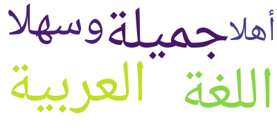
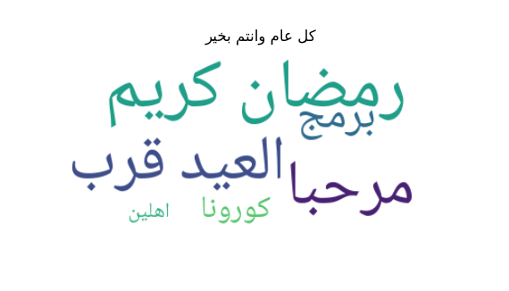
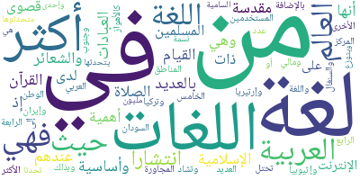
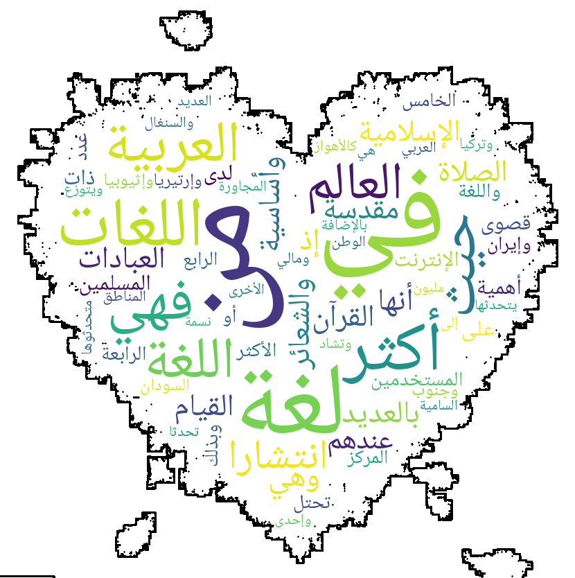

<div align="right" style="text-align: right"><i><sup>✨ May, 17 2020 ✨</sup></i></div>

# ar_wordcloud
A tiny wrapper around [`wordcloud.WordCloud`](https://github.com/amueller/word_cloud/blob/master/wordcloud/wordcloud.py#L154) to support WordCloud with Arabic text.

### Installation:

- `$ pip install ar_wordcloud`

### Usage:

> Also, see the [notebook](examples/how_to.ipynb) example.

Import and instantiate the main class:
```python
from ar_wordcloud import ArabicWordCloud

awc = ArabicWordCloud(background_color="white")
```
Then, either build a word cloud from a raw text string:
```python
t = 'أهلاً وسهلا، اللغة العربية جميلة'
wc = awc.from_text(t)
wc.to_file('hello.png')
```


Or, build a word cloud from a dictionary:
```python
d = {"مرحبا": 12, "برمج": 8, "من": 10, "رمضان كريم": 15, "العيد قرب": 12, "اهلين": 1, "كورونا": 3}
dict_wc = awc.from_dict(d, ignore_stopwords=True)
awc.plot(dict_wc, title="كل عام وانتم بخير", width=2, height=2)
```


Or, read text from a file:

```python
wc = awc.from_file('examples/arabic.txt')
wc.to_file('examples/arabic.png')
```


<hr>

Also, you can use a mask:

```python
from ar_wordcloud import ArabicWordCloud
from ar_wordcloud.utils import read_mask_image

mask_img = read_mask_image() # NOTE: pass `mask_img_url` param to use a different mask, the default is a heart 
awc = ArabicWordCloud(background_color="white", mask=mask_img, contour_width=4)

awc.from_file('examples/arabic.txt').to_image()
```



<hr>

TODO:
- [x] support mask plots
- [ ] clean input text (remove punct .. etc)
- [x] support input from file e.g. `awc.from_file(fname)`
- [ ] browse available fonts and select favorite
- [ ] fix English font
- [ ] cli support

PRs are welcome, thanks 🙏

<hr>

Credit: this repo was born from [the discussion in this PR](https://github.com/amueller/word_cloud/pull/315).
